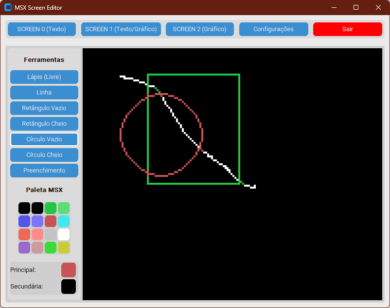

# Graphos - Editor Gráfico para MSX

Uma versão moderna e atualizada do lendário **Graphos III** para MSX, desenvolvida em Python.

## 📖 Sobre o Graphos III Original

O **Graphos III** foi um dos editores gráficos mais populares e completos para computadores MSX na década de 1980. Desenvolvido originalmente em BASIC, oferecia recursos avançados para a época, incluindo:

- Editores de tela para os diferentes modos gráficos do MSX
- Editor de caracteres personalizados
- Sistema de shapes (formas geométricas)
- Gerenciamento de layouts
- Criação e edição de alfabetos customizados
- Ferramentas de desenho e pintura

O Graphos III foi amplamente utilizado por artistas, programadores e entusiastas de MSX para criar gráficos para jogos, demos e aplicações diversas.

## 🎯 Objetivo do Projeto

Este projeto tem como objetivo trazer toda a funcionalidade do Graphos III para uma plataforma moderna, mantendo **100% de compatibilidade** com os recursos originais, enquanto aproveita as vantagens de linguagens e ferramentas contemporâneas.

## 🐍 Tecnologia

O projeto está sendo desenvolvido em **Python**, proporcionando:
- Portabilidade entre diferentes sistemas operacionais
- Facilidade de manutenção e extensão
- Interface gráfica moderna
- Compatibilidade com formatos originais do MSX

## 🚀 Roadmap de Desenvolvimento

### Fase 1: Editor SCREEN 2 ✅ (Em Desenvolvimento)
- Editor de telas para o modo gráfico SCREEN 2 do MSX
- Resolução: 256×192 pixels
- 16 cores por linha de 8 pixels

### Fase 2: Editores SCREEN 1 e SCREEN 0
- **SCREEN 1**: Modo gráfico de 32×24 caracteres
- **SCREEN 0**: Modo texto de 40×24 ou 80×24 caracteres

### Fase 3: Editor de Caracteres
- Criação e edição de caracteres personalizados
- Compatível com os formatos do Graphos III

### Fase 4: Recursos Avançados
- **Shapes**: Editor e gerenciador de formas geométricas
- **Layouts**: Sistema de organização de elementos gráficos
- **Alfabetos**: Criação e edição de fontes customizadas

## 📋 Requisitos

- Python 3.14+
- Ambiente virtual (virtualenv)

## 🛠️ Instalação